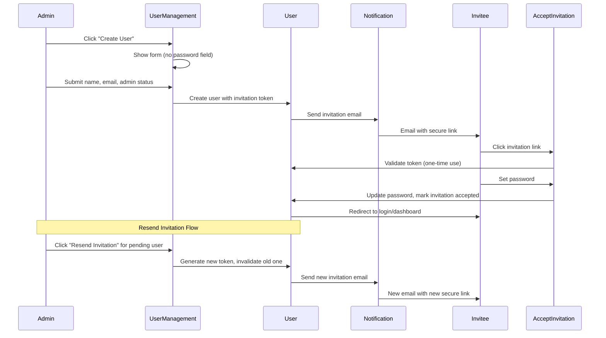

# User Invitation Flow Implementation Plan

## Overview
Implement a secure user invitation flow where administrators can create new users without a password. The invited user receives a welcome email with a secure one-time link to set their password. The link expires after 7 days and can only be used once. Administrators can also resend invitations to users who haven't accepted yet.

## Architecture



## Implementation Details

### 1. Database Schema Changes
Add the following columns to the `users` table:
- `invitation_token` (string, nullable, 255 characters) - Secure one-time token
- `invitation_created_at` (timestamp, nullable) - When invitation was sent
- `invitation_accepted_at` (timestamp, nullable) - When invitation was accepted

Update the User model's `$fillable` array to include these new columns.

### 2. User Model Methods
Add methods to the User model:
- `generateInvitationToken()` - Generates a secure random token
- `sendInvitationNotification()` - Sends the invitation email
- `resendInvitation()` - Generates a new token and resends the invitation email
- `acceptInvitation(string $token, string $password)` - Validates token and sets password
- `isInvitationValid(string $token)` - Checks if token is valid and not expired (7 days)
- `markInvitationAccepted()` - Marks the invitation as accepted
- `hasPendingInvitation()` - Checks if user has a pending invitation
- `getInvitationStatus()` - Returns invitation status (pending, accepted, or none)

### 3. UserInvitation Notification
Create `App\Notifications\UserInvitation` that:
- Extends `Illuminate\Notifications\Notification`
- Implements `ShouldQueue` for asynchronous delivery
- Sends an email with:
  - Welcome message from the inviting admin
  - Secure one-time link to accept invitation
  - Expiration notice (default: 7 days)
- Uses the existing email template patterns

Notification properties:
- `public string $token` - The invitation token
- `public string $inviterName` - Name of the admin who sent the invitation
- `public string $appName` - Application name from config

Notification methods:
- `via($notifiable)` - Returns ['mail']
- `toMail($notifiable)` - Returns the mail message with invitation link
- `invitationUrl()` - Generates the full invitation URL
- `expiryDays()` - Returns the number of days until expiration

### 4. Invitation Acceptance Flow
Create a new Livewire component `AcceptInvitation` that:
- Validates the invitation token from the URL on mount
- Shows a form to set password and confirm password
- Validates password strength (using existing PasswordValidationRules)
- Updates the user's password
- Marks the invitation as accepted
- Invalidates the one-time token (sets to null)
- Redirects to login/dashboard after successful acceptance
- Shows appropriate error messages for:
  - Invalid token
  - Expired token (after 7 days)
  - Token already used
  - User not found

Component properties:
- `public string $token` - The invitation token from URL
- `public string $password` - User's new password
- `public string $password_confirmation` - Password confirmation
- `public ?User $user` - The user associated with the token (computed)

Component methods:
- `mount(string $token)` - Validate token and load user
- `acceptInvitation()` - Process password update and mark as accepted
- `isTokenValid()` - Check if token is valid and not expired

### 5. Routes
Add new routes to `routes/web.php`:
- `GET /invitation/{token}` - Display invitation acceptance form
- `POST /invitation/{token}` - Accept invitation and set password

Route configuration:
- Apply rate limiting middleware to prevent abuse
- Use `web` middleware group for session support
- Consider adding a custom middleware to validate token before showing the form
- Route should be named: `invitation.accept`

### 6. User Management Component Updates
Modify `resources/views/livewire/admin/⚡user-management.blade.php`:
- Remove password field from create user modal
- Update validation rules (remove password requirement)
- Update `createUser()` method to:
  - Generate invitation token
  - Create user without password (set to null)
  - Send invitation notification
  - Display success message
- Add "Resend Invitation" button in the user table for users with pending invitations
- Add `resendInvitation()` method to:
  - Generate a new invitation token
  - Send new invitation notification
  - Display success message
- Add visual indicator for users with pending invitations (e.g., a badge)
- Add a new column or badge to show invitation status:
  - "Pending" - User has not yet accepted invitation (yellow/amber badge)
  - "Accepted" - User has accepted and set password (green badge)
  - No badge - User was created without invitation flow (legacy)
- The "Resend Invitation" button should only appear for users with "Pending" status
- Add a confirmation modal before resending to prevent accidental clicks

### 6.1. User Table UI Changes
The user table should include:
- Existing columns: Name, Email, Role, Created, Actions
- New column: Status (shows invitation status badge)
- Updated Actions column:
  - Edit button (always visible)
  - Delete button (always visible, except for self)
  - Resend Invitation button (only visible for pending invitations)
  - All buttons should use `wire:click.stop` to prevent row click interference

### 7. Security Considerations
- **One-time use**: Token is invalidated after successful password set
- **Expiration**: Tokens expire after 7 days (configurable)
- **Secure token generation**: Use Laravel's `Str::random(60)` for cryptographically secure tokens
- **Rate limiting**: Apply rate limiting to invitation acceptance endpoint
- **Validation**: Verify token belongs to the user before accepting
- **Resend security**: When resending, generate a completely new token (invalidate old one)

### 8. Email Template
The invitation email should include:
- Subject: "You're invited to join [App Name]"
- Greeting: "Hello [User Name],"
- Message: "[Admin Name] has invited you to join [App Name]."
- Call-to-action: Button to "Set Your Password"
- Link: Secure one-time link
- Footer: "This link expires in 7 days and can only be used once."

Email template design considerations:
- Use a clean, professional design matching the application's branding
- Include the app logo or name in the header
- Use a prominent call-to-action button
- Provide a fallback link in case the button doesn't work
- Include the inviting admin's name for personalization
- Add a note that if they didn't request this, they can ignore the email
- Use responsive design for mobile devices

### 9. Testing Strategy
Write tests for:
- Creating a user without password
- Generating and storing invitation token
- Sending invitation notification
- Accepting invitation with valid token
- Rejecting invitation with invalid token
- Rejecting invitation with expired token (after 7 days)
- Ensuring token can only be used once
- Password validation during acceptance
- Redirect after successful acceptance
- Resending invitation for users with pending invitations
- Verifying old token is invalidated when resending
- Checking resend button only shows for users with pending invitations
- Verifying invitation status badge displays correctly

### 10. Configuration (Optional)
Add configuration options to `config/fortify.php`:
- `invitation_token_expiration_days` - Days until token expires (default: 7)
- `invitation_rate_limit` - Rate limit for acceptance attempts

### 11. Resend Invitation Feature
Add the ability for administrators to resend invitation emails:
- Add a "Resend Invitation" button in the user management table for users with pending invitations
- The button should only appear for users who:
  - Have a valid invitation token (not null)
  - Have not yet accepted the invitation (invitation_accepted_at is null)
- When clicked, generate a new invitation token and send a new email
- Display a success message after resending
- Update the user's invitation_created_at timestamp
- Old token is automatically invalidated when a new one is generated

## File Structure

```
app/
├── Models/
│   └── User.php (add invitation methods)
├── Notifications/
│   └── UserInvitation.php (new)
├── Http/
│   └── Requests/
│       └── AcceptInvitationRequest.php (new)
└── Livewire/
    └── Auth/
        └── AcceptInvitation.php (new)

resources/
├── views/
│   └── livewire/
│       ├── auth/
│       │   └── accept-invitation.blade.php (new)
│       └── admin/
│           └── ⚡user-management.blade.php (modify)
└── emails/
    └── user-invitation.blade.php (new)

tests/
└── Feature/
    └── UserInvitationTest.php (new)

database/
└── migrations/
    └── xxxx_add_invitation_fields_to_users_table.php (new)

routes/
└── web.php (add invitation routes)
```

## Best Practices

1. **Use Laravel's built-in features**: Leverage existing password reset token mechanism patterns
2. **Queue emails**: Use `ShouldQueue` for invitation notifications
3. **Validate early**: Validate tokens before showing the form
4. **Clear feedback**: Show clear success/error messages
5. **Security first**: Always validate and sanitize inputs
6. **Test coverage**: Test all happy paths and edge cases
7. **Code formatting**: Run `vendor/bin/pint --dirty` before finalizing
8. **Resend safety**: Always invalidate old tokens when generating new ones
9. **User experience**: Provide clear visual indicators for invitation status
10. **Graceful handling**: Handle edge cases like expired tokens gracefully

## Migration Rollback Plan

If needed, the migration can be rolled back to remove invitation columns without affecting existing users.
